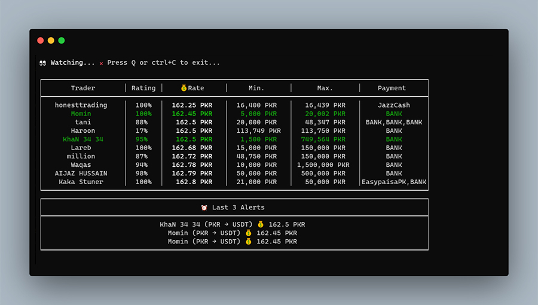

# Binance P2P Alert

It is a simple console based program which notifies when price and amount limit condition is met with available p2p ads.

Can be useful for people who uses binance p2p to buy using their local currency. Although there are no public API available to place p2p orders, program is currently limit to producing alerts only.



---
### Requirements

- NodeJS

## Getting Started

Script can only be run through terminal/command prompt

```shell
# clone this repository
$ git clone https://github.com/wasymshykh/binance-p2p-alert.git

# go to directory
$ cd binance-p2p-alert

# install dependencies
$ npm install

# run the script
$ npm start
```

_Please note that program is only tested on Windows 10, I am not aware of compatibility issues on other operating systems_

## Configuration

Edit [config/index.js](config/index.js) file and change values of following constants

```javascript
// For example I want to buy in range of 164 or below. And purchase limit should be at least 10,000 or above
const ALERT = { 
    price: { amount: 164, or_below: true }, 
    limit: { amount: 10000, or_above: true } 
};

// base unit is the local currency which you'll spend to buy
const BASE_UNIT = "PKR";

// asset unit is the crypto currency you'll buy
const ASSET_UNIT = "USDT";
```
